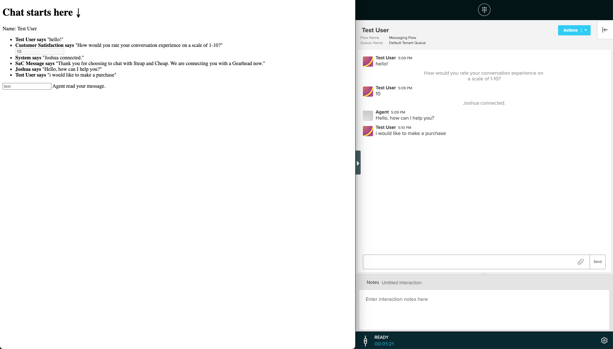

# Creating your own UI for the SerenovaWebChat Messenger

**This guide shows you how to create your own UI for the SerenovaWebChat Messenger.**

The SerenovaWebChat Messenger comes with a rich prebuilt user interface with the option to configure the interface using the [CxEngage's chat widget configuration](https://docs.cxengage.net/Help/Content/Configuration/Chat/configure.htm).

If needed, you can completely replace the default Web Messenger UI with your own interface.

Although you can replace the default UI, note that this means rewriting support for all the message types and indicators that you want to support in your custom UI.

## Overview

The Web Messenger can be initialized without displaying its default UI. You can then make use of the SDK's messaging APIs to send messages and its callback event interface to receive messages.

This guide covers:

  - [Starter code](#starter-code)
  - [Initialize the SDK](#initialize-the-sdk)
  - [Fetch the initial data](#fetch-the-initial-data)
  - [Send messages](#send-messages)
  - [Receive messages](#receive-messages)
  - [Update user](#setting-users-name-and-metadata-optional)
  - [Wrap up](#wrap-up)

It will help to have the [SDK documentation](WEB-CHAT.md) on hand while following this guide.

## Starter code

Note that the complete code is available at the end of this guide.

We start with a basic website with the SerenovaWebChat SDK loaded:

```html
<!DOCTYPE html>
<html lang="en">
  <head>
    <meta charset="UTF-8" />
    <title>Document</title>
  </head>
  <body>
    <script>
      var integrationId = '<your chat widget id (NOT app id) here>';

      !function(s,r,o){
        var p,a,i,c=[],u=[];function e(){try{var e;if((e="string"==typeof this.response?JSON.parse(this.response):this.response).url){var n=r.getElementsByTagName("script")[0],t=r.createElement("script");t.async=!0,t.src=e.url,n.parentNode.insertBefore(t,n)}}catch(e){}}s[o]={init:function(){p=arguments;var n={then:function(e){return u.push({type:"t",next:e}),n},catch:function(e){return u.push({type:"c",next:e}),n}};return n},on:function(){c.push(arguments)},render:function(){a=arguments},destroy:function(){i=arguments}},s.__onWebMessengerHostReady__=function(e){if(delete s.__onWebMessengerHostReady__,s[o]=e,p)for(var n=e.init.apply(e,p),t=0;t<u.length;t++){var r=u[t];n="t"===r.type?n.then(r.next):n.catch(r.next)}a&&e.render.apply(e,a),i&&e.destroy.apply(e,i);for(t=0;t<c.length;t++)e.on.apply(e,c[t])};var n=new XMLHttpRequest;n.addEventListener("load",e),n.open("GET","https://sdk.cxengage.net/webchat/1.0.0/loader.json",!0),n.responseType="json",n.send()
      }(window,document,"SerenovaWebChat",integrationId);
    </script>
  </body>
</html>
```

## Initialize the SDK

To initialize the SDK and access its core messaging APIs without displaying the UI, you must enable embedded mode and provide an invisible container element on render (_note that in future versions, the SDK will ship with a non-rendering mode, but for now it must be rendered in an invisible element_).

- See the documentation for [embedded mode](WEB-CHAT.md#embedded-mode)

First, let's define the HTML element where the default UI will be hidden:

```html
<div id="no-display" style="display:none;"></div>
```

Next, we'll initialize the SerenovaWebChat SDK and render the Web Messenger in our invisible element:

```javascript
SerenovaWebChat.init({ integrationId: integrationId, embedded: true });
SerenovaWebChat.render(document.getElementById('no-display'));
```

## Fetch the initial data

The SDK exposes methods to fetch the appUser object and conversation state. We use these methods to determine the initial state of our UI.

- See the documentation for [`SerenovaWebChat.getConversation`](WEB-CHAT.md#getconversation). This method gives you access to things like the unread messages count, conversation history, and more.

- See the documentation for [`SerenovaWebChat.setUser`](WEB-CHAT.md#setuser). This method allows you to set the customer name and other metadata that can be used in the interaction's flow.

OK, let's write HTML to 1) display the conversation, and 2) display our user ID:

```html
<p>User ID: <span id="user-id"></span></p>
<ul id="conversation"></ul>
```

Let's define a function in our JavaScript code that we can call to display a message in our custom UI:

```javascript
function displayMessage(message, data) {
  var conversationElement = document.getElementById('conversation');
  var messageElement = document.createElement('li');
  messageElement.innerText = message.name + ' says "' + message.text + '" in conversation ' + data.conversation._id;
  conversationElement.appendChild(messageElement);
}
```

Now, we can display the initial conversation state and some user info after we initialize the SDK. Replace the `SerenovaWebChat.init` call with this:

```javascript
SerenovaWebChat.init({ integrationId: integrationId, embedded: true }).then(function() {
  // Displays initial messages
  var conversation = SerenovaWebChat.getConversation();
  conversation.messages.forEach(function(message) {
    displayMessage(message, { conversation: conversation });
  });
});
```

## Send messages

SerenovaWebChat exposes an SDK method to send messages as a user.

- See the documentation for [`SerenovaWebChat.sendMessage`](WEB-CHAT.md#sendmessagemessage). This method allows you to send plain text or structured messages.

We can create an input element in our HTML to accept plain text user messages:

```html
<input type="text" id="text-input" placeholder="text" />
```

Now, we'll call the `SerenovaWebChat.sendMessage` function each time the enter key is pressed while our input element is active. Add the following after your `SerenovaWebChat.init` call:

```javascript
SerenovaWebChat.init({ integrationId: integrationId, embedded: true }).then(function() {
  var inputElement = document.getElementById('text-input');
  inputElement.onkeyup = function(e) {
    if (e.key === 'Enter') {
      SerenovaWebChat.sendMessage(inputElement.value).then(function() {
        inputElement.value = '';
      });
    }
  };

  //...
});
```

Note that this code is being run after `SerenovaWebChat.init` has finished. To confirm that messages are sent, log in as an agent into [Skylight](https://skylight.cxengage.net/) to see the interactions being created and messages being sent.

### Sending form (collect message) responses

If the flow of the interaction contains collect message notations, they will come in as forms. We still call `SerenovaWebChat.sendMessage` to submit the form, but with a different format:

```javascript
SerenovaWebChat.sendMessage(
  {
    type: 'formResponse',
    fields: [
      {
        label: ftMessage.text,
        name: 'collect-message',
        type: 'text',
        text: resInputElement.value,
      },
    ],
    quotedMessageId: ftMessage._id,
  },
  conversation._id
);
```

## Receive messages

In order to update the UI with the content of new messages, we can use SerenovaWebChat's event interface `on`. We're interested in handling two events: [message:received](WEB-CHAT.md#messagereceived) for incoming messages and [message:sent](WEB-CHAT.md#messagesent) for outbound messages.

- See the documentation for [events](WEB-CHAT.md#events)

We're going to call our `displayMessage` function when message events occur. Somewhere in your JavaScript code below where the SDK is loaded, add:

```javascript
SerenovaWebChat.init({ integrationId: integrationId, embedded: true }).then(() => {
  SerenovaWebChat.on('message:sent', displayMessage);
  SerenovaWebChat.on('message:received', displayMessage);

  // ...
});
```

Note again that we're making sure `SerenovaWebChat.init` completes successfully before creating these event subscriptions.

## Setting user's name and metadata (Optional)

If you would like to set the user's name and any additional metadata on the interaction, you can do so by calling [`SerenovaWebChat.updateUser`](WEB-CHAT.md#updateuseruser) _before_ the user sends any messages:

```javascript
SerenovaWebChat.updateUser({
  givenName: nameValue,
  properties: {
    customer: nameValue,
    customDataForFlow: 'example-data' 
  }
});
```

## Wrap up

You've created your own UI for the SerenovaWebChat Messenger. It should look like something like this:



You can find the complete code for this guide here: [SerenovaWebChatExampleCustomUI.html](SerenovaWebChatExampleCustomUI.html).